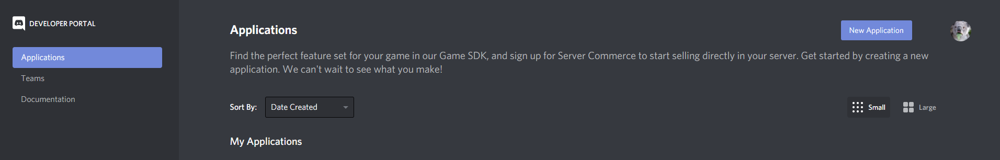
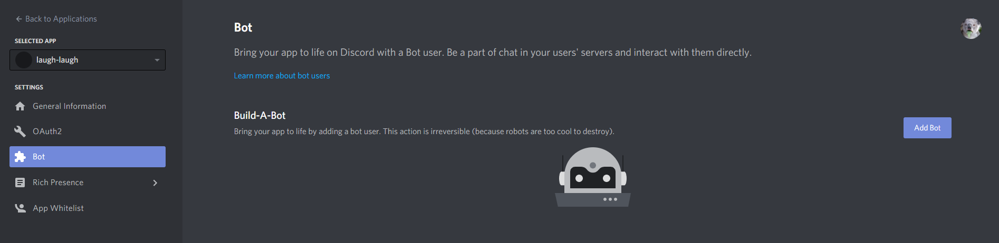
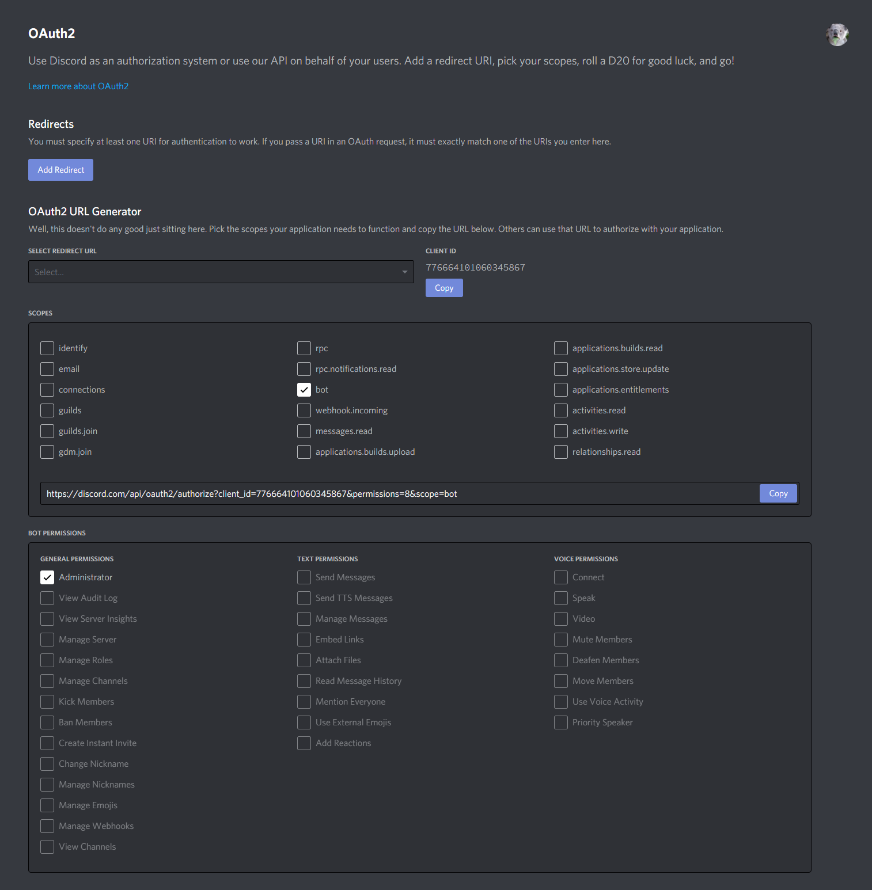
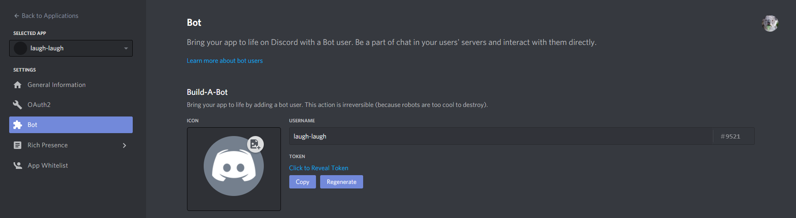

# Laugh In Indonesia
This is a discord bot which contain indonesian audio meme that made with DiscordJs libraries.

# Prerequisites
To run this discord bot you need to install [NPM](https://www.npmjs.com/).

# Installation
## Inviting Bot to Your Server
If you already install `NPM`, you need to invite your own bot to your server.

1. First, you need to make your own discord application. Click [here](https://discord.com/developers/applications) to make one.
</img>
Click `New Application` button at the top right.

1. Create the bot from the application that has been made.
</img>
Click `Bot` menu at the left navigation panel, then click `Add Bot`. You can accept the prompt that will tell you that the bot creation can't be undo.

1. The last step is to invite this bot to your server.
</img>
To get the invitable bot link, you need to check the `bot` option at `SCOPE` menu. After that, the `BOT PERMISSIONS` menu will show up, because this would be your private bot, you can check the `Administrator` permission. To invite this bot, you can copy the link at the `SCOPE` menu and paste it at your new tab.

## Running The Bot Script
1. Download this repositories either by `git clone` command or just download it manually. If you download this repository manually, remember to extract the zip file.

1. Copy the `.env-example` file to a `.env` file. After that, open the `.env` file with your text editor (i.e. notepad, wordpad, etc) and paste your discord bot token at `DISCORD_BOT_TOKEN`.
</img>
To get your discord bot token you can click `COPY` button.

1. Open your terminal/cmd and navigate to the repository directory (e.g. `cd path/to/my/laugh-in-indonesia`).

1. Type `npm install` in your terminal/cmd to download the dependencies for this bot script.

1. Type `npm run start` to run your bot script. If this the script running successfully, you will get `Ready!` message at your terminal/cmd and also your bot at your server will be online.

1. To stop the bot script you can press `Ctrl+c` at your terminal.

# Usage
To see the bot command list, you can type `.help` at your discord text channel.

## Advance Usage/Bot Configuration
You can open config.json file to modify the bot. If you modify this file and wanted the change to be applied, stop the bot and run the bot again.
Config | Default Value | Description
--- | --- | ---
prefix | . | Command prefix to let the bot know that what you type in your server is a command and not a normal text.
playbackVolume | 0.12 | Volume control for the bot. This value is a percentage value, so when you type `0.12` it means `12%`.